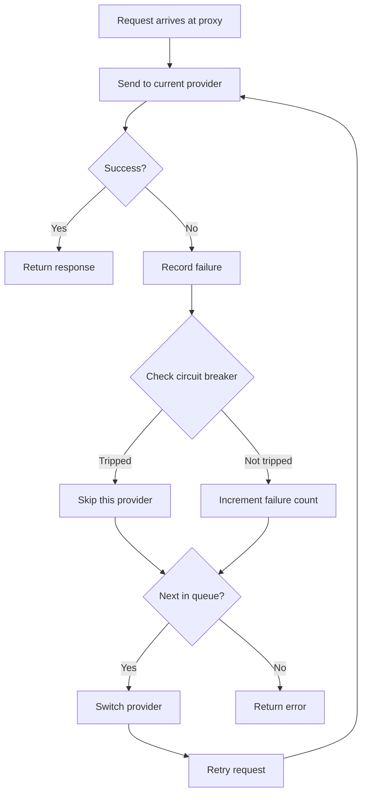
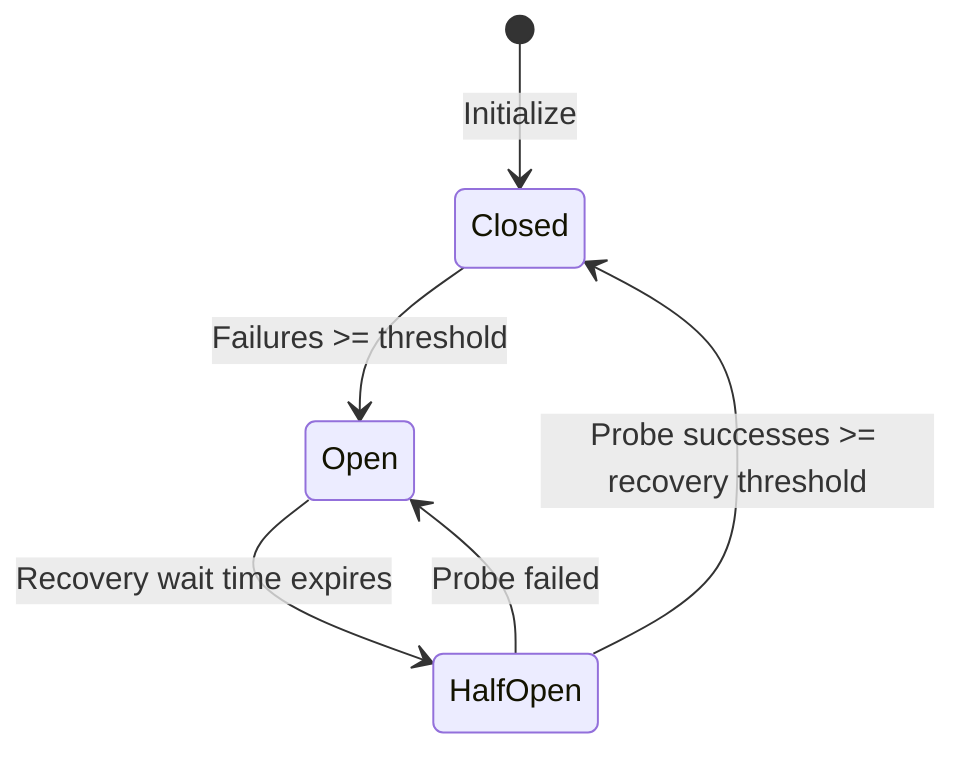

# 4.3 장애 조치

## 개요

장애 조치 기능은 기본 공급자의 요청이 실패하면 자동으로 백업 공급자로 전환하여 서비스가 중단되지 않도록 합니다.

**적용 시나리오**:
- 불안정한 공급자 서비스
- 높은 가용성 요구 사항
- 장시간 실행 작업

## 사전 조건

장애 조치 기능을 사용하려면 다음이 필요합니다.

1. Proxy service 시작
2. 앱 takeover 활성화
3. 장애 조치 큐 구성
4. 자동 장애 조치 활성화

## 장애 조치 큐 구성

### 구성 페이지 열기

Settings > Advanced > Failover

### 애플리케이션 선택

페이지 상단에는 세 개의 탭이 있습니다.
- Claude
- Codex
- Gemini

구성할 애플리케이션을 선택합니다.

### 백업 공급자 추가

1. "Failover Queue" 영역에서
2. "Add Provider"를 클릭합니다.
3. 드롭다운 목록에서 공급자를 선택합니다.
4. 공급자가 큐의 마지막에 추가됩니다.

### 우선순위 조정

공급자를 드래그하여 순서를 조정합니다.
- 숫자가 낮을수록 우선순위가 높습니다.
- 기본 공급자가 실패한 뒤 백업 공급자를 순서대로 시도합니다.

### 공급자 제거

공급자 오른쪽의 "Remove" 버튼을 클릭합니다.

## 기본 인터페이스 빠른 작업

proxy와 장애 조치가 모두 활성화되면 공급자 카드에 장애 조치 토글이 표시됩니다.

### 큐에 추가

1. 공급자 카드를 찾습니다.
2. 장애 조치 토글을 켭니다.
3. 공급자가 큐에 자동으로 추가됩니다.

### 큐에서 제거

1. 공급자 카드의 장애 조치 토글을 끕니다.
2. 공급자가 큐에서 제거됩니다.

## 자동 장애 조치 활성화

### 단계

1. 장애 조치 구성 페이지에서
2. "Auto Failover" 토글을 켭니다.

### 토글 설명

| 상태 | 동작 |
|-------|----------|
| 끔 | 실패만 기록하고 자동으로 전환하지 않음 |
| 켬 | 실패 시 다음 공급자로 자동 전환 |

## 장애 조치 흐름

## Circuit breaker 구성

circuit breaker는 실패하는 공급자에 대해 빈번하게 재시도하는 일을 막습니다.

### 구성 항목

앱마다 기본 구성이 독립적입니다. 아래는 일반 기본값이며 Claude에는 자체 완화된 구성이 있습니다.

| 설정 | 설명 | 일반 기본값 | Claude 기본값 | 범위 |
|---------|-------------|-----------------|----------------|-------|
| Failure Threshold | circuit breaker를 발생시키는 연속 실패 횟수 | 4 | 8 | 1-20 |
| Recovery Success Threshold | half-open 상태에서 breaker를 닫는 데 필요한 성공 횟수 | 2 | 3 | 1-10 |
| Recovery Wait Time | 발생 후 복구를 시도하기까지의 시간(초) | 60 | 90 | 0-300 |
| Error Rate Threshold | circuit breaker를 여는 오류율 | 60% | 70% | 0-100% |
| Minimum Requests | 오류율 계산 전 필요한 최소 요청 수 | 10 | 15 | 5-100 |

> Claude는 요청 시간이 더 길기 때문에 더 많은 실패를 허용하는 완화된 기본 설정을 사용합니다.

### Timeout 구성

| 설정 | 설명 | 일반 기본값 | Claude 기본값 | 범위 |
|---------|-------------|-----------------|----------------|-------|
| Stream First Byte Timeout | 첫 데이터 chunk까지의 최대 대기 시간(초) | 60 | 90 | 1-120 |
| Stream Idle Timeout | 데이터 chunk 사이의 최대 간격(초) | 120 | 180 | 60-600 (0이면 비활성화) |
| Non-stream Timeout | non-streaming 요청의 전체 timeout(초) | 600 | 600 | 60-1200 |

### Retry 구성

| 설정 | 설명 | 일반 기본값 | Claude 기본값 | 범위 |
|---------|-------------|-----------------|----------------|-------|
| Max Retries | 요청 실패 시 재시도 횟수 | 3 | 6 | 0-10 |

> Gemini의 기본 최대 재시도 횟수는 5입니다.

### Circuit breaker 상태

| 상태 | 설명 |
|-------|-------------|
| Closed | 정상 상태, 요청 허용 |
| Open | circuit가 끊긴 상태, 이 공급자를 건너뜀 |
| Half-Open | 복구 시도 중, probe 요청 전송 |

### 상태 전이

## 상태 표시기

### 공급자 카드

카드는 상태 badge를 표시합니다.

| Badge | 상태 | 설명 |
|-------|--------|-------------|
| 초록색 | 정상 | 연속 실패 0회 |
| 노란색 | 경고 | 실패는 있으나 circuit breaker가 발생하지 않음 |
| 빨간색 | Circuit Broken | circuit breaker가 발생하여 일시적으로 건너뜀 |

### 큐 목록

장애 조치 큐도 각 공급자의 상태를 표시합니다.

## 장애 조치 로그

각 장애 조치 이벤트는 다음을 기록합니다.

| 정보 | 설명 |
|-------------|-------------|
| 시간 | 발생 시점 |
| 원래 공급자 | 실패한 공급자 |
| 새 공급자 | 전환한 공급자 |
| 실패 이유 | 오류 메시지 |

사용량 통계 안의 요청 로그에서 볼 수 있습니다.

## 모범 사례

### 큐 구성 권장 사항

1. **기본 공급자**: 가장 안정적이고 빠른 공급자
2. **첫 번째 백업**: 두 번째로 좋은 선택
3. **두 번째 백업**: 최후의 수단

### Circuit breaker 구성 권장 사항

| 시나리오 | Failure Threshold | Recovery Wait |
|----------|-------------------|---------------|
| 높은 가용성 요구 사항 | 2 | 30초 |
| 일반 시나리오 | 3 | 60초 |
| 가끔의 실패를 허용 | 5 | 120초 |

### 모니터링 권장 사항

정기적으로 다음을 확인합니다.
- 각 공급자의 상태
- 장애 조치 빈도
- circuit breaker 발생 빈도

## FAQ

### 장애 조치가 발생하지 않습니다

다음을 확인합니다.
1. proxy service가 실행 중인가요?
2. 앱 takeover가 활성화되어 있나요?
3. 자동 장애 조치가 활성화되어 있나요?
4. 큐에 백업 공급자가 있나요?

### 장애 조치가 너무 자주 발생합니다

가능한 원인:
- 불안정한 기본 공급자
- 네트워크 문제
- 구성 오류

해결 방법:
- 기본 공급자 상태를 확인합니다.
- circuit breaker 파라미터를 조정합니다.
- 기본 공급자 교체를 고려합니다.

### 모든 공급자의 circuit가 끊겼습니다

복구 대기 시간이 지나 자동 복구될 때까지 기다리거나, 다음을 수행합니다.
1. proxy service를 수동으로 다시 시작합니다.
2. circuit breaker 상태를 재설정합니다.
